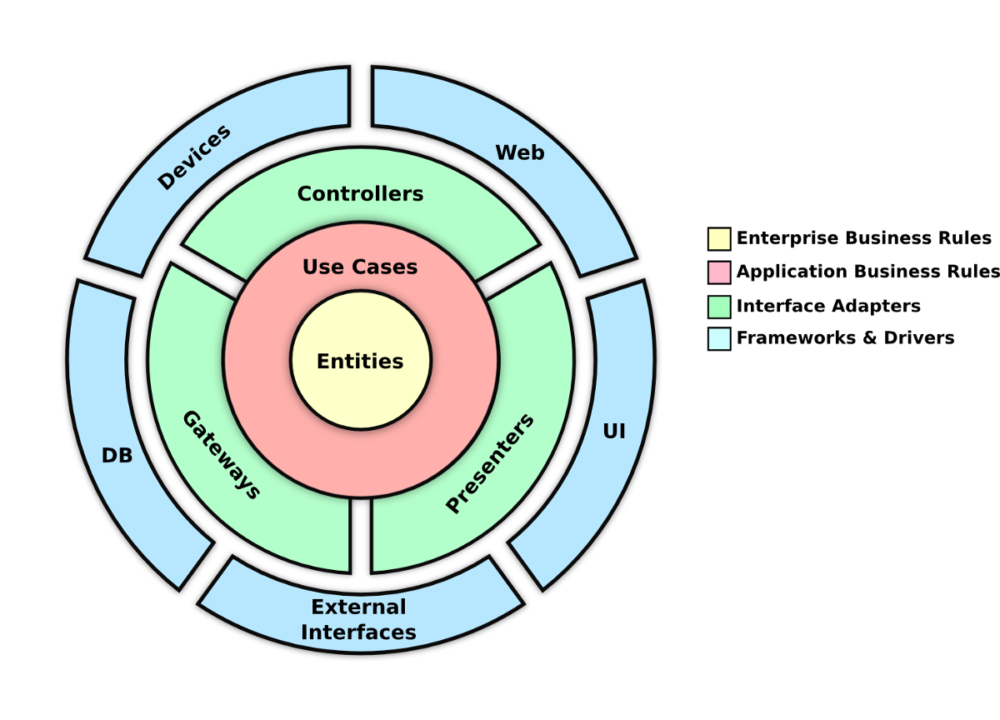
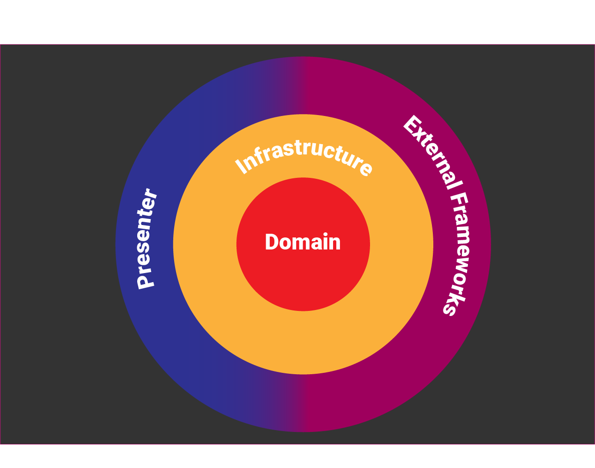

# Clean Dart
Clean architecture proposal for Dart/Flutter.

# Introduction

A clean architecture can define the future of your project, so we must study it constantly to know where and how to apply it.

For this proposal, we will be based on the Clean Architecture layers proposed by Robert C. Martin in the book **“Clean Architecture: A Craftsman's Guide to Software Structure and Design”**.

# Clean Architecture layers

** Robert C. Martin** concludes that a clean architecture must have at least 4 principal and independent layers to be “clean”, they are:

1. Enterprise Business Rules
2. Application Business Rules
3. Interface Adapters
4. Frameworks & Drivers (External)

## Enterprise Business Rules

It’s the most sensitive rules of a system, because of that is the highest layer and is represented by data models called **“Entities”**. 

An **“Entity”** must be pure, which means that it cannot know any layer, only other layers know it.

## Application Business Rules

It’s the rules that only the computer can execute, here we have the representation of the commands called **“Use cases”** that basically represents all of the actions that the user can perform in the application.

An **“Use case”** only knows the Entities and no more lower layers.

If an **“Use case”** needs to access a higher layer must use the **“Dependency Inversion Principle”** from SOLID.

## Interface Adapters

It’s responsible for helping the higher layers to convert the external data to a format that respects the interface contracts defined in the business rules.

## Frameworks & Drivers

Todas as abstrações feitas pelas camadas mais altas foram para aumentar a facilidade do plugin&play dos artefatos externos como uma BASE DE DADOS ou uma INTERFACE DE USUÁRIO(UI).

Essa camada normalmente sofre muitas modificações, porém com uma arquitetura limpa aplicada isso pode ser completamente indolor e segura para a sua regra de negócio.

Podemos então trocar uma API REST por outra em GraphQl sem afetar suas regras de negócio. Poderemos também trocar a interface gráfica completamente ou até mesmo trocar o Flutter pelo AngularDart e mesmo assim as Regras de Negócio ficarão funcionais!

Dado as descrições iremos apresentar a proposta de Arquitetura Limpa da Flutterando, a **“Clean Dart”**.

# Clean Dart

Usando o Flutter como exemplo teremos então quatro camadas mantendo a “Arquitetura de Plugin”, com foco principal no Domínio da Aplicação, camada esta que hospeda as 2 Regras de Negócio principais, estamos falando das **Entidades** e dos **Casos de Uso**.

A proposta de Arquitetura se propõe a desacoplar as camadas mais externas e preservar a Regra de Negócio.

## Presenter

A Camada **Presenter** fica responsável por declarar as entradas, saídas e interações da aplicação. 

Usando o Flutter como exemplo, hospedaremos os Widgets, Pages e também Alguma Gerência de Estado, já no backend como exemplo, seria nesta camada onde colocaríamos os Handlers ou Commands da nossa API.

## Domain

A camada de **Domain** hospedará as Regras de Negócio Corporativa(Entity) e da Aplicação(Usecase).

Nossas Entidades devem ser Objetos simples podendo conter regras de validação dos seus dados por meio de funções ou ValueObjects. **A Entidade não deve usar nenhum Objeto das outras camadas.**

Os **Casos de Uso** devem executar a lógica necessária para resolver o problema. Se o **Caso de Uso** precisar de algum acesso externo então esse acesso deve ser feito por meio de contratos de interface que serão implementados em uma camada de mais baixo nível.

Na camada **Domain** dever ser responsável apenas pela execução da lógica de negócio, não deve haver implementações de outros Objetos como Repositories ou Services dentro do **Domain**. 

Tomando um Repository como exemplo, teremos que ter apenas o contrato de interfaces(Abstrações) e a responsabilidade de implementação desse objeto deverá ser repassado a outra camada mais baixa.

## Infrastructure(Infra)

Está camada dá suporte a camada **Domain** implementando suas interfaces. Para isso, essa camada se propõem a adaptar os dados externos para que possa cumprir os contratos do domínio.

Muito provavelmente nessa camada iremos implementar alguma interface de um Repository ou Services que pode ou não depender de dados externos como uma API ou acesso a algum Hardware como por exemplo Bluetooth. 

Para que o Repository possa processar e adaptar os dados externos devemos criar contratos para esses serviços visando passar a responsabilidade de implementação para a camada mais baixa da nossa arquitetura.

Como sugestão, iremos criar objetos de **DataSource** quando quisermos acessar um dado externo, uma BaaS como Firebase ou um Cache Local usando SQLite por exemplo.
Outra sugestão seria criar objetos denominados **Drivers** para interfacear a comunicação com algum Hardware do dispositivo.

Os acessos externos como Datasources e Drivers devem ser implementados por outra camada, ficando apenas os Contratos de Interface nesta camada de Infra.

## External

Aqui começaremos a implementar os acessos externos e que dependem de um hardware, package ou acesso muito específico.

Basicamente a camada External deve conter tudo aquilo que terá grandes chances de ser alterado sem que o programador possa intervir diretamente no projeto.

No Flutter por exemplo, para cache local usamos o SharedPreferences, mas talvez em alguma estágio do projeto a implementação do SharedPreferences não seja mais suficiente para a aplicação e deve ser substituída por outro package como Hive, nesse ponto a única coisa que precisamos fazer é criar uma nova classe, implementando o Contrato esperado pela camada mais alta (que seria a **Infra**) e implementarmos a Lógica usando o Hive.

Um outro exemplo prático seria pensar em um Login com Firebase Auth, porém outro produto deseja utilizar um outro provider de autenticação. Bastaria apenas implementar um datasource baseado no outro provider e “Inverter a Dependência” substituindo a implementação do Firebase pela nova quando for necessário.

Os Datasources devem se preocupar apenas em “descobrir” os dados externos e enviar para a camada de Infra para serem tratados.

Da mesma forma os objetos **Drivers** devem apenas retornar as informações solicitadas sobre o Hardware do Device e não devem fazer tratamento fora ao que lhe foi solicitado no contrato.

# Dicas

## Pense por camada

Quando for desenvolver comece a pensar por camada, não devemos nos preocupar com o que tem na camada de **Presenter** ou **External** por exemplo. Se pensarmos nas camadas mais externas podemos acabar nos orientando (erroneamente) por essas camadas. Assim, devemos nos acostumar a desenvolver camada por camada, de dentro para fora e não ao contrário.

Talvez no começo da sua jornada "Limpa" algumas camadas possam parecer "sem utilidade", isso acontece quando nossa mente ainda não está **Pensando em Camadas** (ou porque sua Regra de Negócio é simples demais para isso)

## Teste de Unidade será sua nova UI

É muito comum os desenvolvedores criarem primeiro as suas Views para pode "testar" as Regras de Negócio. Mas nós já temos uma ferramenta própria para isso e um lugar dedicado para armazenar esses testes.

Desenvolver de forma "limpa" está em total sinergia com o **TDD**(Test Driven Development) pois a camada de **Presenter** será uma das últimas coisas que iremos pensar no desenvolvimento da nossa feature.

## Gaste mais tempo tratando erros

**"É melhor deixar uma Exception acontecer do que tratar um erro de forma genérica"...**
Uma boa dica é usar alguma classe que nos obrigue a tratar os erros como o **Either** do pacote **dartz**.

Either é uma classe que pode receber dois tipos de dados, um Left (para quando enviar o erro) e o Right(para enviar o dado esperado). Isso também diminui muito a necessidade de realizar um tratamento manual de erro com **try catch** em camadas mais superiores como **Presenter**.

## Não caia na tentação de furar uma camada

Algumas vezes você poderá ter um **UseCase** muito simples, que apenas repassará para o **Repository**, como por exemplo em um CRUD onde você apenas precisa validar se a informação está chegando da maneira correta e repassar para o **Repository** fazer seu trabalho. 

Parece estranho você ter uma classe com um método que faz somente a validação dos dados e repassa para outra classe, porem você verá a grande utilidade disso no momento de uma manutenção. Pois muitas vezes o **UseCase** pode nascer pequeno mas em um futuro próximo ele pode ganhar corpo. 

Um exemplo disso é a utilização do Firebase, o package do Firebase te retornar uma Stream que você pode muito bem colocar ele direto na sua **View**, porem se um dia você quiser remover o firebase do seu projeto, você terá que reconstruir toda sua tela ou pior todo seu projeto.

Sendo assim não caia na tentação de chamar o **Repository** direto do **Controller** ou mesmo plugar o Firebase direto na sua **View**, além de infringir as regras da arquitetura, você irá se arrepender em um futuro próximo.

# Assine!

Apreciariamos o seu Feedback!
Se concorda com a Proposta de Arquitetura Limpa "Clean Dart" faça isso deixando uma **Star** nesse repositório. Uma **Star** é o mesmo que assinar um "manifesto limpo" concordando com essa proposta.

Estamos abertos a sugestões e melhorias na documentação!
Faça isso por meio das [issues](https://github.com/Flutterando/Clean-Dart/issues), nossa equipe ficará muito contente com seu interesse em melhorar essa ferramenta para a comunidade.

Sinta-se a vontade para abrir um **PR** com correções na documentação dessa proposta.

# Exemplos

- [Clean Dart Login with Firebase, MobX and Modular](https://github.com/jacobaraujo7/login-firebase-clean-dart)
- [Clean Dart Github Search with BLoC and Modular](https://github.com/Flutterando/clean-dart-search-bloc)
- [Clean Dart Github Search with MobX and Modular](https://github.com/jacobaraujo7/clean-dart-search-mobx)
- [Chat WebSocket with Get_It and Cubit](https://github.com/rodrigorahman/flutter_curso_chat_websocket) 

# Links úteis

- [Resumo do livro "Arquitetura Limpa"](https://medium.com/@deividchari/desvendando-a-arquitetura-limpa-de-uncle-bob-3e60d9aa9cce)
- [Sua Arquitetura está limpa?](https://medium.com/flutterando/sua-arquitetura-est%C3%A1-limpa-clean-architecture-no-flutter-458c68fad120)
- [Os tijolos do Clean Architecture](https://www.youtube.com/watch?v=C8mpy3pwqQc)
- [The Clean Code Blog](https://blog.cleancoder.com/uncle-bob/2012/08/13/the-clean-architecture.html)
- [Guilherme's Proposal](https://github.com/guilherme-v/flutter-clean-arch)
